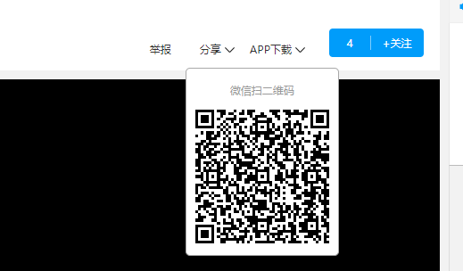
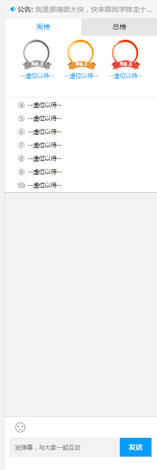

## 软件介绍
富秀直播电脑版是公司新研发的平民直播平台，倡导“团队合作，齐心协力；的绿色直播文化，以用户在线互动直播为核心，向广大平民直播爱好者展示专注、健康、积极的直播平台。
#### 电脑版网站首页

## 注册与登录
#### 注册
如果没有账号需要先注册，可以手机号注册或者是三方注册，手机号注册输入手机号设置密码会向手机发送验证码，输入验证码以后则注册成功

#### 登录
如果注册成功或者已经有富秀直播账号，直接点击登录

登录成功后即可进入富秀直播
## 直播间
#### 进入直播间可以看直播
下图为直播间页面

#### 关注
直播间上侧是主播昵称喜欢可以点击右测得关注按钮，右面为该房间主播的关注度，热度等

#### 微信扫一扫
还可以通过右上方微信扫一扫分享给别人

#### APP下载

#### 直播间信息
直播间最右侧为直播间排行榜，下面是聊天面板，右上方公告是聊天显示、榜单、等级等显示处，公告下下面的周榜和总榜是根据用户的等级进行排列的，分为周榜和总榜两部分，这样会排列出前三名，会显示用户的头像和昵称用，户排名下面还会显示自己的等级，富秀聊天系统软件等级由低到高可分为：白板、青铜、白银、黄金，当有新用户进入到直播间的时候，在直播间聊天白板上会显示欢迎某某某来到直播间

在聊天框输入聊天的内容的时候，在飘屏的同时也会在聊天白板上显示聊天的内容

输入聊天内容，在聊天白板显示，聊天内容前面是输入聊天内容者的昵称或者是主播或者房管，如下图

#### 房管
在直播间里，主播有任命房管、取消房管以及禁言的功能，任命房管之后，房管也可以去给别人禁言在用户昵称处点击，即可出现下图，可以点击任命房管对此用户进行设置，最后点击确定

#### 弹幕
在直播间观看直播的时候，发送文字会飘屏，这是如果不想看到很多文字飘屏，即可点击屏幕下方的弹幕，这时文字就不会显示了

最右下方是聊天框，旁边为礼物赠送
在直播间中的交流方式聊天中还可赠送礼物给自己喜欢的主播
充值右面即礼物种类

### 直播页面
#### 直播页面
点击全部，会进入直播列表页面

直播页面中，左侧为富秀直播的一些功能点，右侧为直播栏目，可以分为全网直播和联盟直播，点击任何一个直播即可进入直播间观看想看的直播节目

#### 直播页-左侧搜索框
左侧搜索框可以搜索游戏或者主播的昵称或者主播的ID

#### 直播页-直播页左侧各处功能
直播间左侧会显示昵称等级头像，其他功能主要包括退出、充值、消费记录、商城、赠送、关注、和分类列表以及我要做主播

### 点击充值

### 消费记录

### 商城

### 赠送

### 关注

### 直播页-我要做主播

点击我要做主播，即可进入个人中心关于主播页面，进行主播申请
## 首页分类
### 分类
