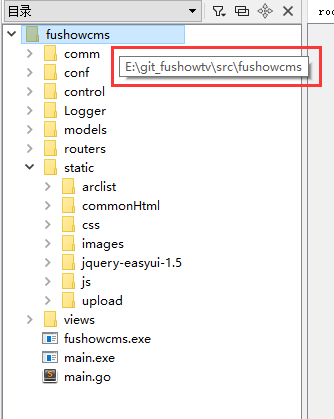
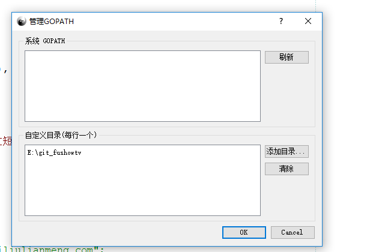
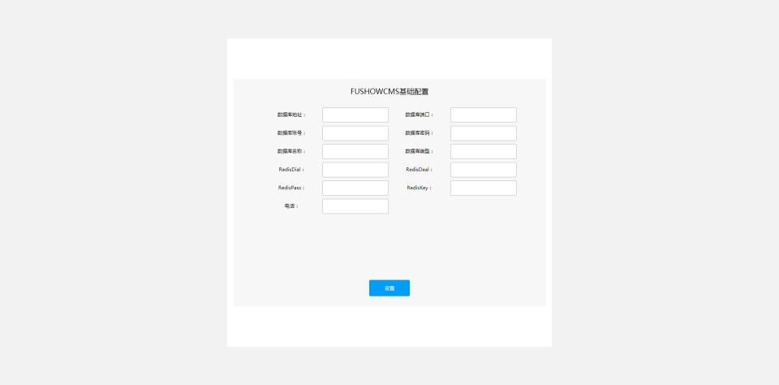

## 一. 安装配置手顺
### 1.	在本地E盘目录下创建新文件夹，如下 E:\git_fushowtv\src
### 2.	将在github上下载的代码放到src目录下
### 3.	用LiteIDE打开代码

### 4.	配置GOPATH
查看-管理GOPATH

### 5. 启动程序（快捷键：Ctrl+r）如下图所示启动成功
```
[GIN-debug] Listening and serving HTTP on :80
```
### 6.	浏览器访问 http://localhost/page/setup

### 7.	填写基础配置，然后重新启动程序
### 8.	访问http://localhost

## 二. 富秀cms目录结构说明
### 1.	目录结构说明
	- fushowcms
		- main.go		 //主程序启动文件
		- comm
			- config.go    //底层共通配置文件
		- conf
			- app.conf     //数据库，redis等工具配置文件
			- msg.conf	 //message说明
		- control		 //处理业务逻辑
		- Logger		 //logger日志
		- models		 //对数据库进行操作
		- routers		 //路由层
		- static		 //静态文件（js，css）存放位置
		- views		     //html存放位置

## 三. 注意事项
### 1. 短信接口
注册，忘记密码等需要发送短信的接口，需要自行注册短信接口
### 2. 阿里云推流
阿里云推流码等相关功能，需要自行购买
### 3. 商城，支付，三方登录
商城，支付，三方登录等功能暂时不开源
### 4. Apollo聊天
在 users.properties 配置文件中添加账号密码
Apollo聊天服务器需要在fushowcms/static/js/page/roomlive.js中配置相应账号密码
### 5. 商务合作联系电话:400-863-5885
### 6. 官网:http://www.fushow.cn/